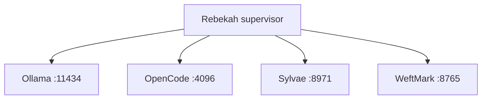

<p align="center">
  <a href="https://github.com/tabenius/WeftMark">
    
  </a>
</p>

<h1 align="center">Rebekah</h1>

<p align="center">
  A reproducible, self-hosted runtime for governed agentic software work.
</p>

> [!IMPORTANT]
> Rebekah is an executable bootstrap, not yet a production-ready distribution.
> The core image builds and its four supervised services pass an end-to-end
> container smoke test.

## Purpose

Rebekah builds a Docker-compatible OCI image with **Nix**. It combines local
inference, agent execution, engineering provenance, and durable review evidence
without creating another source of truth.

The current image contains:

- **OpenCode server** — provider-neutral interactive agent sessions.
- **Ollama server** — local model inference.
- **[WeftMark](https://github.com/tabenius/WeftMark)** — Change Sets, semantic
  scopes, Git lineage, evidence, handoff, review, and readiness.
- **[Sylvae](https://github.com/tabenius/sylvae)** — portable `SKILL.md`
  execution with durable run evidence.

The image also includes the fail-closed **Ephor/KAGP connector**. Ephor is the
**Konsonans AI Governance Platform (KAGP)**, maintained in
[`tabenius/BAZ.AI-governance`](https://github.com/tabenius/BAZ.AI-governance).

## System boundary

| Component | Authoritative responsibility | Runtime status |
| --- | --- | --- |
| OpenCode | Interactive agent sessions and workspace access | Packaged and supervised |
| Ollama | Local model inference | Packaged and supervised |
| Sylvae | Skill execution and run evidence | Packaged and supervised |
| WeftMark | Engineering provenance, review, evidence policy, and readiness | Packaged and supervised |
| Ephor/KAGP | Governance policy, risk, oversight, and audit-chain records | Fail-closed connector implemented |
| Rebekah | Packaging, isolation, wiring, lifecycle, and integration verification | Implemented bootstrap |

Each runtime service has a distinct UID, a distinct primary group (gid == uid),
and its own state directory, so a `0750` state directory is readable only by the
owning service. The supervisor starts services with `no-new-privileges` and
`--clear-groups`, binds them to container loopback, checks their real health
endpoints, forwards termination, and fails when any required service exits.

## Runtime topology



All ports are internal and loopback-only. Remote access belongs behind an
authenticated TLS proxy or secure tunnel. Secrets must be injected at runtime;
they must not enter the image or Nix store.

The OpenCode server is not left open on loopback. The supervisor sets
`OPENCODE_SERVER_PASSWORD` — the value you provide, or a per-boot random one —
and writes it root-only to `/run/rebekah/opencode-password`; OpenCode then
requires HTTP Basic auth (user `opencode`) on every endpoint. Set the variable
explicitly if you need a stable password for a client, or read the generated
one from that file inside the container.

WeftMark operates on the Git repository mounted at `/workspace` and requires a
valid `HEAD`. Persistent service data lives under `/var/lib/rebekah`.

## Correlation spine

A governed unit of work must remain traceable across participating services:

| Authority | Correlated identifier |
| --- | --- |
| WeftMark | Change Set ID — the workflow subject |
| OpenCode | Session ID |
| Sylvae | `run_id` |
| Ephor/KAGP | `entry_id` and `chain_hash` |

Ephor governance decisions enter WeftMark as typed `governance` evidence
(record kind `ephor:governance`). Ephor supplies the policy decision
and tamper-evident chain reference; WeftMark remains responsible for deciding
whether a Change Set is `READY`.

See the [bootstrap integration contract](docs/bootstrap-contract.md) for the
correlation envelope, deployment boundary, evidence shape, fail-closed
semantics, and acceptance test.

## Build

Nix with flakes enabled and a Docker-compatible runtime are required.

```bash
nix flake check
nix build .#image
docker load < result
```

The flake lock pins nixpkgs, WeftMark, Sylvae, and the BAZ.AI-governance
(Ephor/KAGP) source for reproducible evaluation. If `ephor-src` is not yet in
your local `flake.lock`, run `nix flake lock` (or `nix flake update ephor-src`)
once to record the pin.

`tabenius/BAZ.AI-governance` is private, so fetching `ephor-src` requires a
GitHub token with read access to it. Locally, add it to `~/.config/nix/nix.conf`
as `access-tokens = github.com=<token>` (or `NIX_CONFIG`). In CI, set the
`EPHOR_READ_TOKEN` repository secret to a PAT (or fine-grained token) with read
access to that repo; the workflow passes it to Nix as the github.com access
token. The default `GITHUB_TOKEN` cannot read another private repository, so
without this secret `nix flake check` fails with a `404` on `ephor-src`.

## Run

Create a persistent state volume and mount a real Git repository:

```bash
docker volume create rebekah-state

docker run --rm \
  --read-only \
  --cap-drop=ALL \
  --cap-add=CHOWN --cap-add=DAC_OVERRIDE \
  --cap-add=SETUID --cap-add=SETGID --cap-add=KILL \
  --security-opt=no-new-privileges \
  --tmpfs /run/rebekah:rw,noexec,nosuid,size=16m \
  --tmpfs /tmp:rw,noexec,nosuid,size=64m \
  --mount type=volume,src=rebekah-state,dst=/var/lib/rebekah \
  --mount type=bind,src="$PWD",dst=/workspace \
  -e REBEKAH_CHANGE_SET_ID=your-change-set-id \
  rebekah:latest
```

The entrypoint initializes volume ownership for the four isolated service UIDs.
The mounted workspace is the only Git safe-directory exception configured by
the runtime.

Run with least privilege. The supervisor needs only five Linux capabilities —
`CHOWN` (set up state directories), `SETUID`/`SETGID` (launch each service as
its own uid), `KILL` (forward termination to the cross-uid children), and
`DAC_OVERRIDE` (so a root `docker exec` of `rebekah-govern` can write the
weftmark-owned ledger) — so the example drops everything else Docker grants root
by default and adds `no-new-privileges`. The container's smoke test runs under
exactly this set.

The image ships **no model weights** — Ollama starts with an empty model store.
Pull a model into the persistent state volume before requesting inference; it is
retained across runs on the `rebekah-state` volume:

```bash
docker exec <container-name> ollama pull llama3.2
```

Useful diagnostics:

```bash
docker run --rm --mount type=bind,src="$PWD",dst=/workspace rebekah:latest doctor
docker exec <container-name> rebekah-health
```

## Ephor/KAGP governance

Configure the local Rust `governance-http` bridge and evaluate a Change Set:

```bash
export EPHOR_URL=http://127.0.0.1:9800
export REBEKAH_CHANGE_SET_ID=cs-example
export REBEKAH_SYLVAE_RUN_ID=run-example
rebekah-ephor evaluate
```

For the Cloudflare Worker API, also set `EPHOR_API_STYLE=worker`. An optional
`EPHOR_AUTH_TOKEN` is sent as a bearer token. Successful evaluations produce
`cc.ragbaz.rebekah.governance-evidence.v0` JSON with the Ephor entry ID and a
normalized `sha256:` chain hash. Every denial, hold, transport error, malformed
response, invalid hash, or missing configuration exits nonzero and records a
non-passed evidence state.

## Verify

After loading the image, run the same immutable-root integration test used by
CI:

```bash
bash tests/smoke.sh
```

The test creates a disposable Git repository, starts the container with a
read-only root filesystem, and requires successful health responses from all
four services.

## Repository layout

- `flake.nix` exposes the OCI image and package checks.
- `flake.lock` pins every source input.
- `nix/image.nix` defines the image, identities, volumes, health check, and
  OCI metadata.
- `nix/entrypoint.sh` implements supervision, diagnostics, health checks, and
  shutdown.
- `nix/packages/` packages WeftMark and Sylvae from their pinned sources.
- `tests/smoke.sh` verifies the loaded image through Docker.
- `docs/bootstrap-contract.md` defines integration semantics and acceptance
  criteria.
- `docs/ephor-governance-worker.md` references the merged Ephor governance
  Worker (endpoints, bindings, audit chain) the connector calls into.
- `.github/workflows/ci.yml` checks the connector, builds and loads the image, and runs the service smoke test.

## Current status

**Core runtime complete.** The reproducible image packages and supervises
OpenCode, Ollama, Sylvae, and WeftMark. The image also provides `rebekah-ephor`,
which calls KAGP's capture/finalize boundary and emits normalized typed evidence.
CI validates approval plus fail-closed denial, hold, malformed-response,
unavailable-service, and missing-configuration paths.

**Governance attachment complete.** `rebekah-govern` attaches the connector
output through WeftMark's real evidence interface as dedicated
`governance` evidence, requires it for the review decision, and the
smoke test proves the readiness effect. See
[docs/ephor-governance-worker.md](docs/ephor-governance-worker.md) for the
merged reference implementation the connector calls into.
